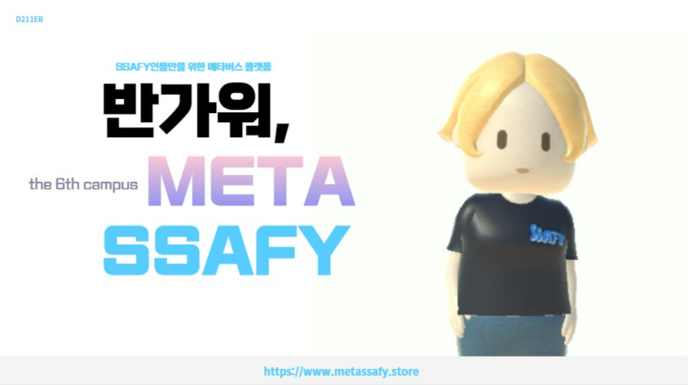
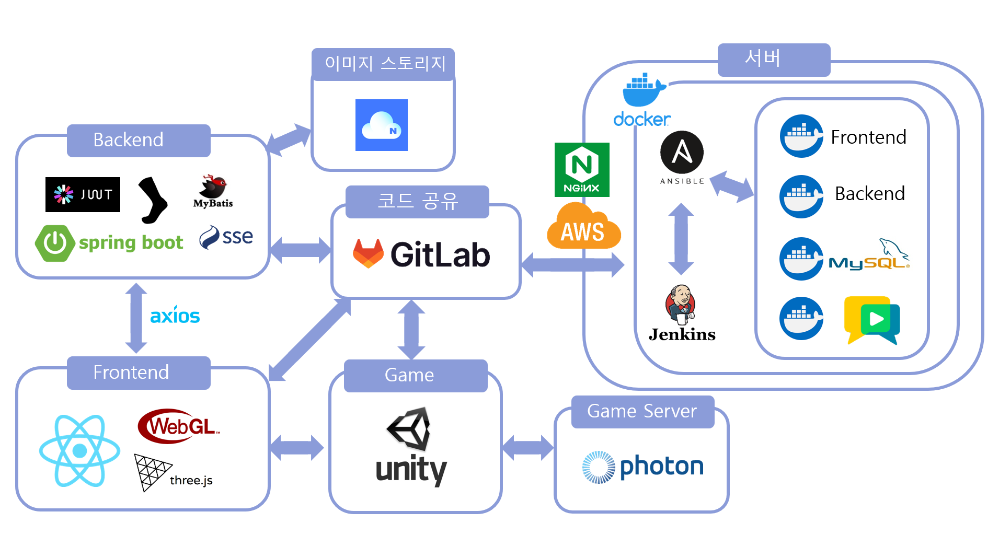
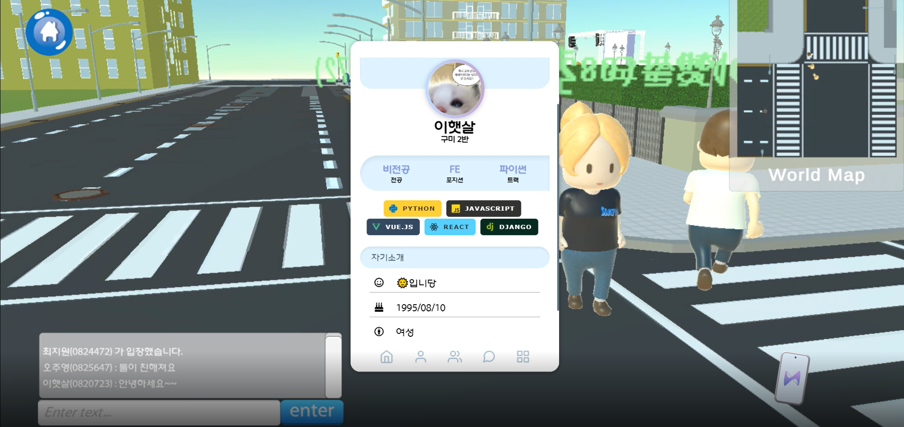
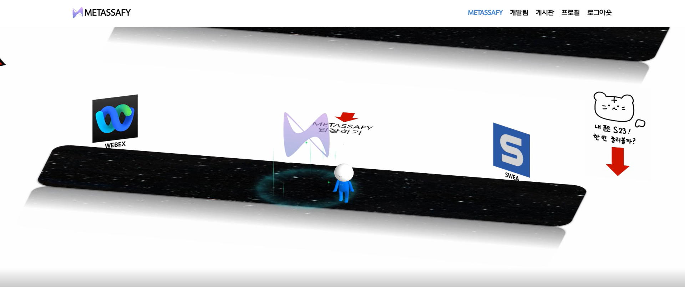
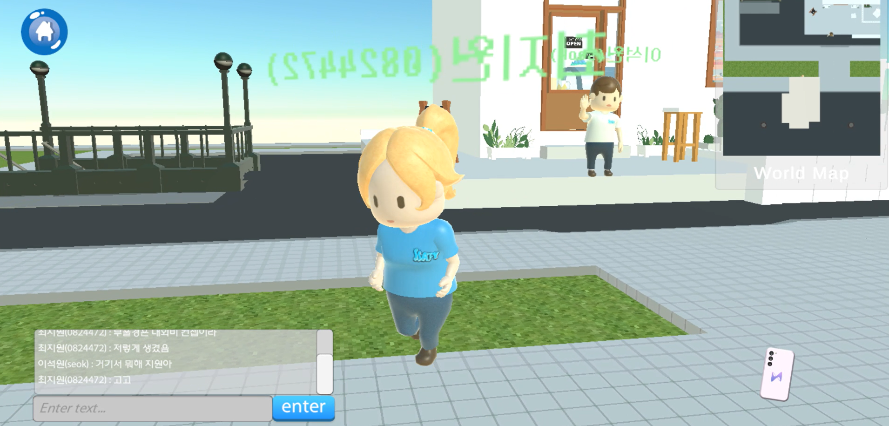
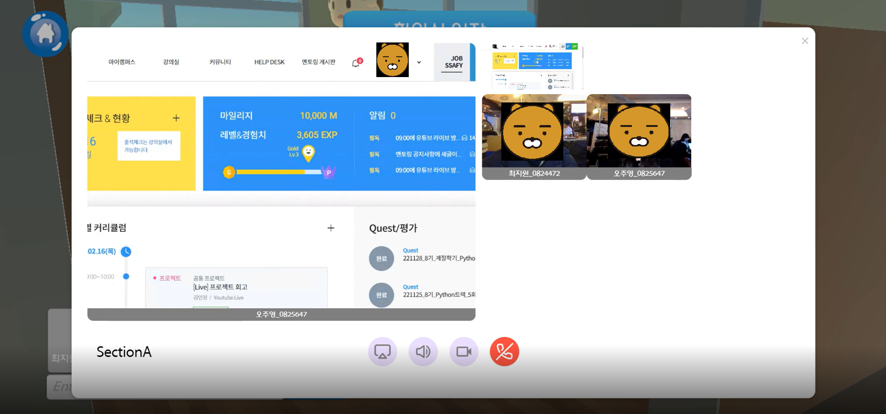
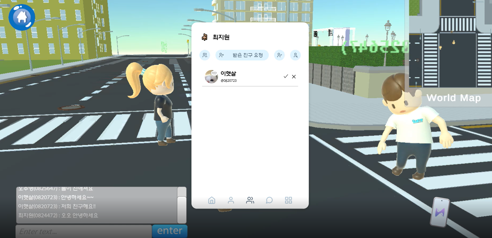
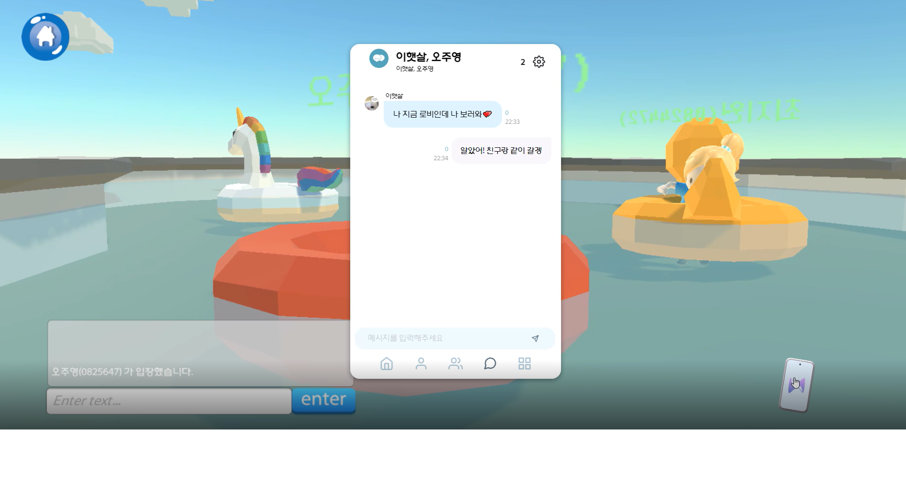
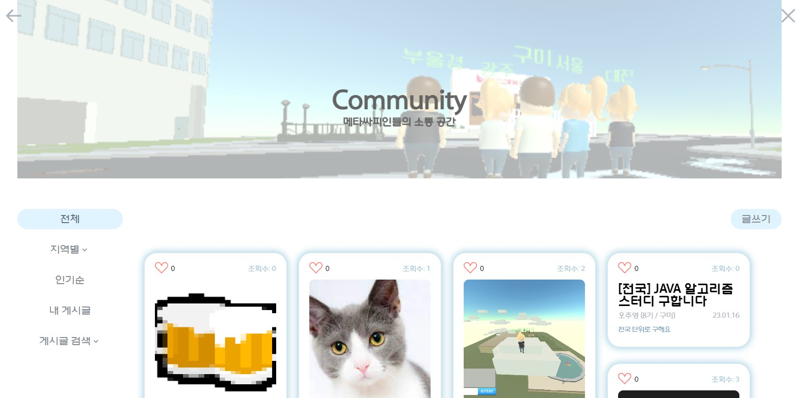

## METASSAFY

싸피 캠퍼스는 총 5개의 지역에 위치하고 있지만, 다른 지역의 교육생과는 교류하기 힘듭니다. 
이러한 문제를 해결하기 위하여 싸피의 6번째 캠퍼스, 메타싸피를 개발하였습니다.  
 
## 기술 스택 & 아키텍쳐

 
## 서비스 소개 

### 회원 관리

기본적인 회원가입, 로그인, 프로필 수정, 탈퇴가 가능합니다.

### 싱글 메타버스

멀티 메타버스 페이지를 비롯한 다양한 페이지로 이동할 수 있는 화면입니다. 

### 멀티 메타버스

멀티 플레이가 가능한 메타버스 페이지입니다.  
채팅, 감정표현, 맵 이동이 가능하며,  메타버스 내 오브젝트를 클릭하여 핸드폰 페이지, 화상 채팅 페이지, 게시판 페이지 등을 모달로 띄울 수 있습니다. 

### 화상채팅

회의실에 입장하여 화상채팅을 할 수 있습니다.
  화면 공유, 카메라 공유가 가능합니다.

### 친구 관리

친구 신청, 친구 신청 수락/거절, 친구 목록 보기, 친구 삭제 등
친구와 관련된 기능을 제공합니다.

### 채팅

원하는 사람들과 채팅방을 만들어 이야기를 나눌 수 있습니다.

### 게시판

게시판에 글을 쓸 수 있습니다. 
수정, 삭제, 댓글, 대댓글, 좋아요 등이 가능합니다. 
